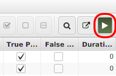

# ReproDroid
<p align="center">
	
</p>

## Installation
#### Method 1 (recommended): Pre-installed Virtual Machine
``++`` Ready to use,  
``++`` This tutorial is written for this method. Copying and pasting commands will work,  
``++`` Faster method,  
``+`` Almost up-to-date (06/05/2018).

1. Download the virtual machine (VM): [https://uni-paderborn.sciebo.de/s/wuVTfzmTf0oum67](https://uni-paderborn.sciebo.de/s/wuVTfzmTf0oum67)
2. Launch the VM via Virtual Box: [https://www.virtualbox.org/wiki/Downloads](https://www.virtualbox.org/wiki/Downloads)
	- Start the *Virtual Box Manager*
	- Open *File* menu
	- Click *Import Appliance*
	- Navigate to and select the downloaded file: ``ESEC_FSE_ReproDroid.ova``
	- Click *Next*
	- *(optional)* Adjust the memory usage (default: 8GB)
	- Click *Finish*
		- Wait until the VM has been imported
	- Start the *ESEC_FSE_ReproDroid* VM
		- Wait until it has been booted
3. *Note:* Any password possibly required by the virtual machine is: ``esecfse``
4. Setup keyboard layout (Currently: german)
	- Click on *menu* (bottom-left)
	- Open *Control Center*
	- Open *Keyboard*
	- Switch to *Layouts*
	- Choose or add your preference
	- Click *Close*

#### Method 2: Manual Setup
``--`` Requires manual installation ALL analysis tools in order to reproduce ALL results of the paper,  
``-`` The paths used in this tutorial may differ on your system. Copying and pasting commands will NOT work,  
``-`` Slower method,  
``++`` Up-to-date.

1. Install the required analysis tools (very time consuming task - Suggestion: Only install Amandroid if you decide to use this method! - Tutorial: [here](https://github.com/FoelliX/BREW/wiki/Runthrough))
  - Amandroid: [https://bintray.com/arguslab/maven/argus-saf/3.1.2](https://bintray.com/arguslab/maven/argus-saf/3.1.2)
  - DIALDroid: [https://github.com/dialdroid-android/DIALDroid](https://github.com/dialdroid-android/DIALDroid)
  - DidFail: [https://www.cert.org/secure-coding/tools/didfail.cfm](https://www.cert.org/secure-coding/tools/didfail.cfm)
  - DroidSafe: [https://mit-pac.github.io/droidsafe-src](https://mit-pac.github.io/droidsafe-src)
  - FlowDroid: [https://github.com/secure-software-engineering/soot-infoflow-android/wiki](https://github.com/secure-software-engineering/soot-infoflow-android/wiki)
  - IccTA: [https://sites.google.com/site/icctawebpage/source-and-usage](https://sites.google.com/site/icctawebpage/source-and-usage)
2. Install BREW by following this tutorial: [here](https://github.com/FoelliX/BREW/wiki/Install_Compile)
3. Configure BREW by following this tutorial: [here](https://github.com/FoelliX/BREW/wiki/Configuration)

## Testing
This guide presents the basic functionality of BREW on top of a simple example. Hence, it explains (i) how to setup a benchmark consisting of only one app, (ii) how to refine this benchmark and (iii) how to run and evaluate it.

1. Open a terminal (Ctrl+Alt+T)
2. Navigate to the BREW directory: ``cd ~/reprodroid/BREW``
3. Run BREW with one config from ``~/reprodroid/configurations`` (e.g. ``config_Amandroid.xml``):
```bash
java -jar BREW-1.1.1.jar -config ~/reprodroid/configurations/config_Amandroid.xml
```
4. Wait for the graphical user interface (GUI) to show up
5. Load a file
	- Open the *File* menu
	- Click on *Load File..*
		- Navigate to and select/open the following file: ``~/reprodroid/benchmarks/DroidBench30/benchmark/apks/AndroidSpecific/DirectLeak1.apk``
6. Click on *Next* (Green Right-Arrow in the toolbar)
	- Press *F5* or click *Refresh IDs* in the *Edit* menu, if you cannot see all 6 Sources and Sinks
7. Select sources & sinks
	- Click on *Preselect Sources & Sinks based on SuSi* (Checked checkbox in the toolbar)
	- *(optional)* Manually check if the selection is correct
8. Click on *Next* again (Green Right-Arrow in the toolbar)
9. Run the benchmark
	- *(optional)* Manually check if the constructed benchmark case is correct
	- Click on *Run Benchmark* (Green Play-Button on the right in the toolbar)  
	  
		- Wait until the analysis tool - now running in the background - finishes its analysis
		- If you have used the ``config_Amandroid.xml`` the first row of the table should have a light green background now to signal that the analysis result is correct
10. Review the benchmark result
	- *(optional)* Check the stats in the *Statistics* pane (on the bottom)
	- *(optional)* Review it in detail
		- Select the first row of the table
		- Press *V* or click on *Show in Viewer* (magnifying glass in the toolbar)
		- Switch to the *Graph* tab on the left and on the right hand side
		- Manually compare the left (expected) results with the right (actual) result
		- Close the *Comparison Viewer*
11. Click on *Run Benchmark* again (Green Play-Button on the right in the toolbar)
	- The analysis tool is not executed again - the previously computed result is reloaded
12. Reset/Delete the stored analysis results
	- Open the *File* menu again
	- Click on *Reset storage*
	- Open the *Edit* menu
	- Click on *Reset markings* to reset the table
13. Click on *Save* (Floppy Disk symbol in the toolbar) to store the current setup as default setup
14. Exit/Close the GUI
15. Run benchmark from command line (here using Amandroid again):
```bash
java -jar BREW-1.1.1.jar -config ~/reprodroid/configurations/config_Amandroid.xml -nogui
```

## Reproducing Paper Results
1. Open a terminal (Ctrl+Alt+T)
2. Navigate to the BREW directory: ``cd ~/reprodroid/BREW``
3. Decide for which analysis tool you want to reprocude the paper results.
	- Select the analysis tool by starting BREW with its associated configuration:
		- Amandroid:
		```bash
		java -jar BREW-1.1.1.jar -config ../configurations/config_Amandroid.xml -timeout 20m
		```
		- DIALDroid *:
		```bash
		java -jar BREW-1.1.1.jar -config ../configurations/config_DIALDroid.xml -timeout 20m
		```
		- DidFail *:
		```bash
		java -jar BREW-1.1.1.jar -config ../configurations/config_DidFail.xml -timeout 20m
		```
		- DroidSafe *:
		```bash
		java -jar BREW-1.1.1.jar -config ../configurations/config_DroidSafe.xml -timeout 20m
		```
		- FlowDroid:
		```bash
		java -jar BREW-1.1.1.jar -config ../configurations/config_FlowDroid.xml -timeout 20m
		```
		- IccTA:
		```bash
		java -jar BREW-1.1.1.jar -config ../configurations/config_IccTA.xml -timeout 20m
		```
			- *: Not recommended since it is either slow or imprecise
			- ``-timeout 20m`` sets the maximal execution time per benchmark case to 20 minutes
4. Load the benchmark for which you want to reproduce the paper results
	- Open the *File* menu
	- Click *Open..*
		- All benchmarks can be found in ``~/reprodroid/benchmarks``
		- Choose one by selecting the ``data.ser`` inside a benchmark's ``benchmark`` directory
			- For example, navigate to and select/open the following file: ``~/reprodroid/benchmarks/DroidBench30/benchmark/data.ser``
5. *(optional)* Inspect the available cases
6. Click on *Next* (Green Right-Arrow in the toolbar)
7. *(optional)* Inspect the available sources & sinks
8. Click on *Next* again
9. *(optional)* Inspect which benchmark cases have been constructed
10. **[probably taking minutes/hours/days - depending on the analysis tool and benchmark choosen]** Click on *Run Benchmark* (Green Play-Button on the right in the toolbar)  
    
11. Wait for the benchmark-run to end
12. Inspect the result (Precision, Recall, F-measure in the *Statistics* pane) and compare it to the results in the paper
13. *(optional)* Inspect single results:
	- Select one benchmark case in the table
	- Press *V* or click on *Show in Viewer* (magnifying glass in the toolbar)
14. Exit/Close the GUI
15. Return to step 3. and repeat for another analysis tool and/or benchmark

## Reviewing Paper Results
1. Open a terminal (Ctrl+Alt+T)
2. Navigate to the BREW directory: ``cd ~/reprodroid/BREW``
3. Select the result you want to review
	- Lets assume you want to review the results of Amandroid for the DroidBench 3.0 benchmark
4. Copy the benchmark result into the BREW directory:
	```bash
	cp -R ~/reprodroid/benchmarks/DroidBench30/results/Amandroid/data .
	```
3. Run BREW:
	```bash
	java -jar BREW-1.1.1.jar -config ../configurations/config_Amandroid.xml
	```
4. Click on *Next* (Green Right-Arrow in the toolbar)
5. When asked to relocate some apk files:
	- Click on *Directory*
		- Navigate to and select/open the following directory: ``~/reprodroid/benchmarks/DroidBench30/benchmark/apks``
6. Click on *Next* again (Green Right-Arrow in the toolbar)
7. When asked if checkboxes should be restored:
	- Click on *Yes*
8. Inspect the result (Precision, Recall, F-measure in the *Statistics* pane) and compare it to the results in the paper
9. *(optional)* Inspect single results:
	- Select one benchmark case in the table
	- Press *V* or click on *Show in Viewer* (magnifying glass in the toolbar)
10. Exit/Close the GUI
11. Return to step 3. and repeat for another analysis tool and/or benchmark

## Remarks
The virtual machine is setup with *8GB* memory only. Feel free to adjust this value. If so, please adjust the configuration files in ``~/reprodroid/configurations`` accordingly. A tutorial on how to adjust a configuration can be found: [here](https://github.com/FoelliX/AQL-System/wiki/Configuration).
For the paper a virtual machine with *32GB* memory has been used. Therefore, and depending on your host's specifications analyses may take longer and perhaps exceed the maximal execution time. For this reason, result may differ from those presented in the paper. This only holds for the part described in **Reproducing Paper Results**.