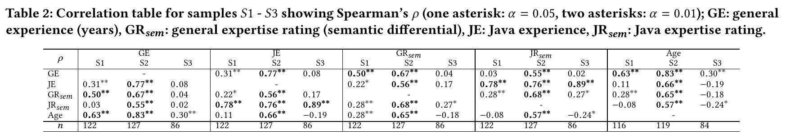
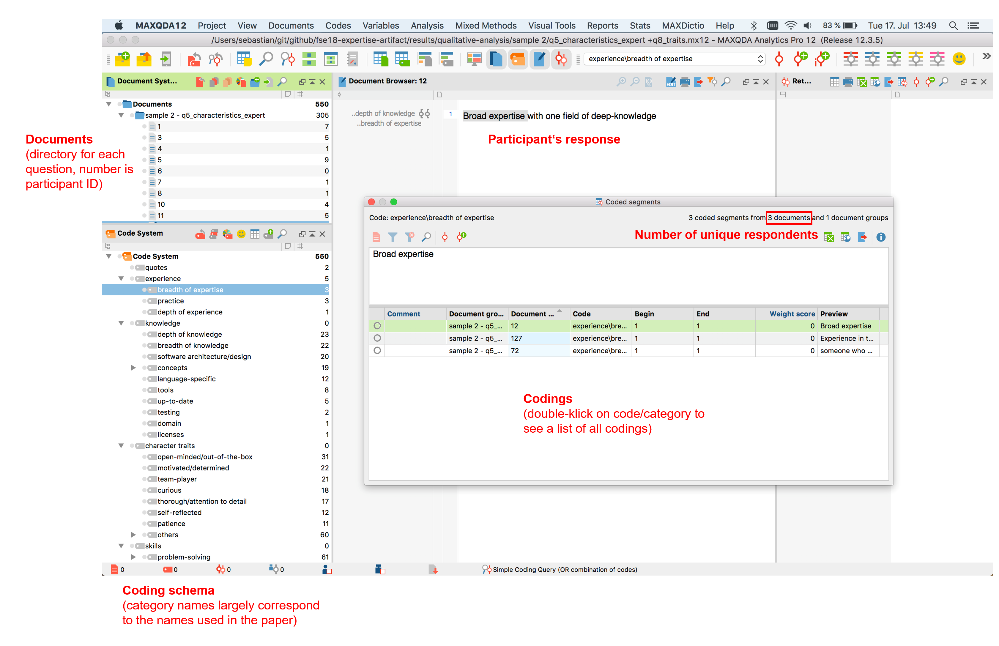

# Artifact for ESEC/FSE 2018 paper "Towards a Theory of Software Development Expertise"

This artifact enables researchers to replicate the quantitative results from our  [paper](http://empirical-software.engineering/assets/pdf/fse18-expertise.pdf) and to trace the qualitative results from the high-level concepts and categories described in the paper to participants' responses.

## Documentation

In the directory `doc`, you will find the questionnaires and codebooks used for sample S1 (phase 2) and samples S2 and S3 (phase 3). Moreover, we provide our research questions for phases 1 and 2.

## Demographics

To create the file `results/demographics.csv`, which corresponds to Table 1 in the paper, please execute the R script `src/demographics.R`. This R script also creates two figures that didn't make it into the paper (`results/boxplots_experience_expertise.pdf` and `results/likert_expertise.pdf`) and contains analyses of demographic variables that we described in Sections 3.1 and 5.2 (*gender*, *main role*, *continent*).

## Closed-ended questions

In Section 5.3 of the paper, we describe results from closed-ended questions asking about the concepts *monitoring*,  *mentoring*, and *performance decline*. You will find the corresponding analyses in the R script `src/closed_ended_questions.R`.

## Experience and Expertise

The correlation table mentioned in Section 6.1 can be found in the directory `doc`:

The R script `src/correlations.R`  creates three CSV files for each sample:

1. `results/correlations_sample{1|2|3}_coefficients.csv` containing the calculated correlation coefficients.
2. `results/correlations_sample{1|2|3}_p-values.csv` containing the corresponding p-values.
3. `results/correlations_sample{1|2|3}_n.csv` containing the number of observations considered for the calculation of the correlations.

To replicate the analysis described in Section 6.2, please open the R script `src/self-assessments.R`. You will find the reported statistics in this file. Moreover, you can create the figure `results/boxplots_dreyfus.pdf` that visualizes the results (but didn't make it into the paper).

## Coding Schema

The trace to concepts and categories described in Sections 3 to 5, please open the MAXQDA files provided in the directory `results/qualitative-analysis/sample{1|2|3}`.
In directory `doc`, we also provide a brief description of MAXQDA's GUI:

## Anonymity

We removed all user names, email addresses, websites, and company names that could identify individual participants. If you observe any information that could identify participants, please immediately inform us (research@sbaltes.com).

## Code frequencies

Please note that the frequencies displayed in MAXQDA may differ from the number of answers we provided in the paper (usually in brackets). The reason for this is that MAXQDA counts the number of codes, but we counted the number of distinct respondents; there may be multiple codes per answer. You can see the number of distinct respondents in the "Coded segments" view (see above). Please note that in some cases, we added up the answers from multiple samples (S2 and S3).

## Citation

The dataset is available on Zenodo:

Please cite it as:

**Towards a Theory of Software Development Expertise — Supplementary Material.** 
<u>Sebastian Baltes</u> and Stephan Diehl. 
[<i class="fas fa-fw fa-external-link-alt" aria-hidden="true"></i> http://doi.org/10.5281/zenodo.1299798](https://doi.org/10.5281/zenodo.1299798)

## License

The dataset is licensed under the <a rel="license" href="http://creativecommons.org/licenses/by/4.0/">Creative Commons Attribution 4.0 International License</a>.
